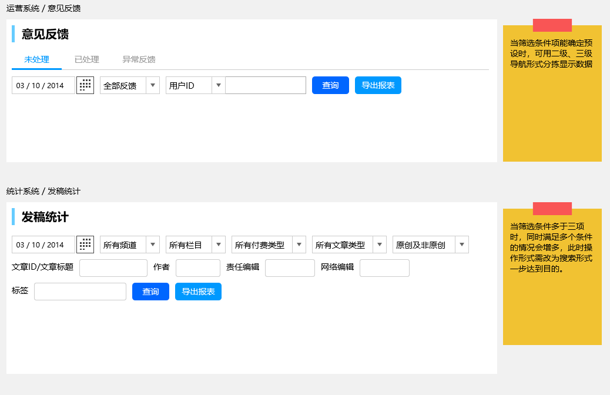
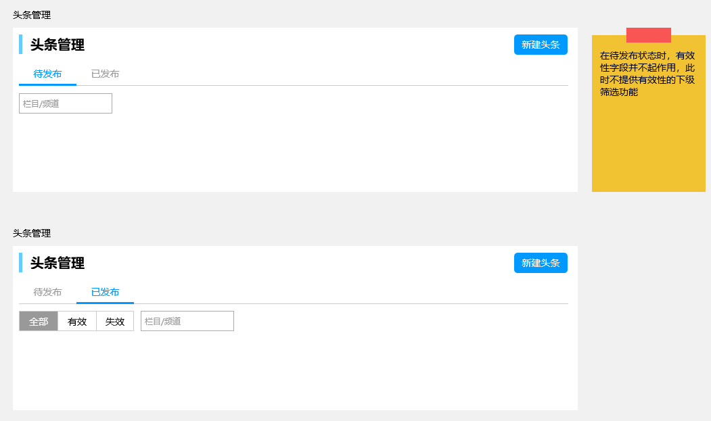

# 数据筛选

数据包含内容很多，想找到想要的数据需要层层筛选。为满足多种需要，条件会越来越多，使用就越复杂。

一般情况下，筛选会经过导航逐级拆分（如：根据文章栏目找到具体文章），寻找数据的条件较多时，使用搜索（或者叫查询）的情形居多。

## 其他模式

### 数据表格内筛选

[代表控件 - datatables.net](https://datatables.net/) | [样例](https://keenthemes.com/metronic/preview/?page=crud/datatables/search-options/column-search&demo=default)

受限于数据栏目及展示形式，在使用者角度较为合理及美观，在开发者角度此类功能设计需考虑多种问题（UI复杂度、数据获得渠道等），使用此模式需认知考虑能否符合使用需求。