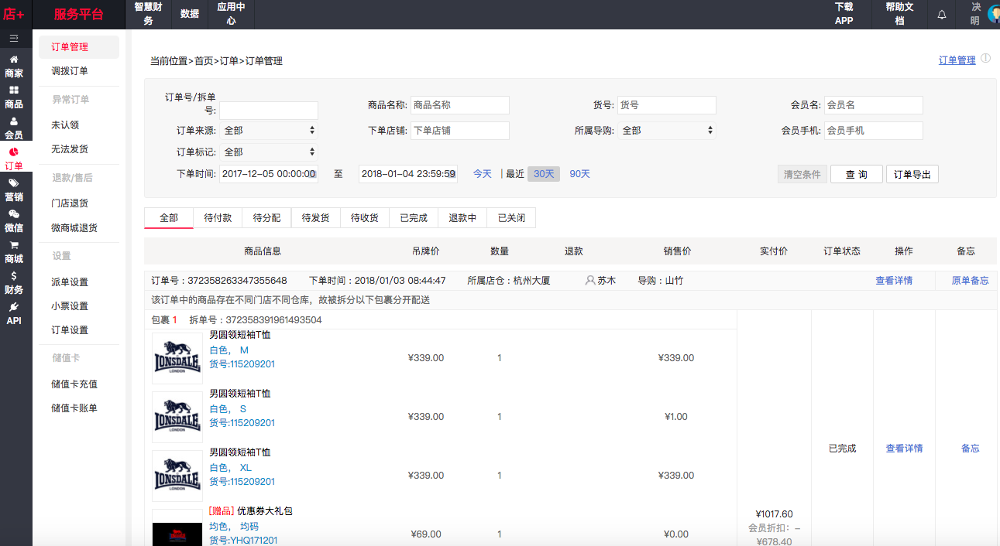
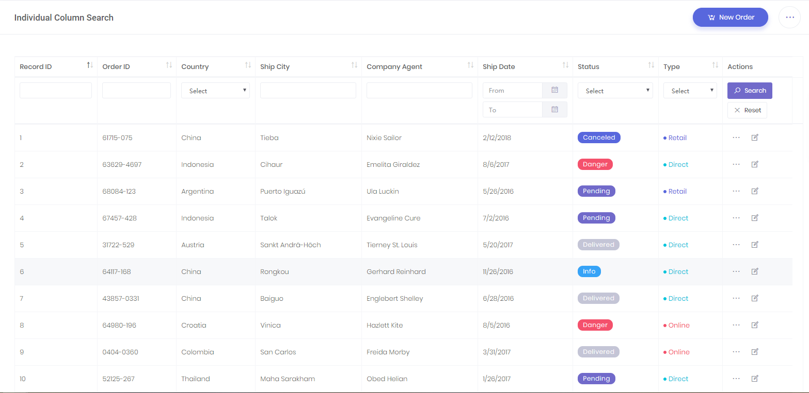

# 数据筛选

## 类搜索方式筛选

能满足多维度筛选及不同界面设计需求，是常用而灵活的模式。

## 数据表格内筛选

[代表控件 - datatables.net](https://datatables.net/) | [样例](https://keenthemes.com/metronic/preview/?page=crud/datatables/search-options/column-search&demo=default)

受限于数据栏目及展示形式，在使用者角度较为合理及美观，在开发者角度此类功能设计需考虑多种问题（UI复杂度、数据获得渠道等），使用此模式需认知考虑能否符合使用需求。